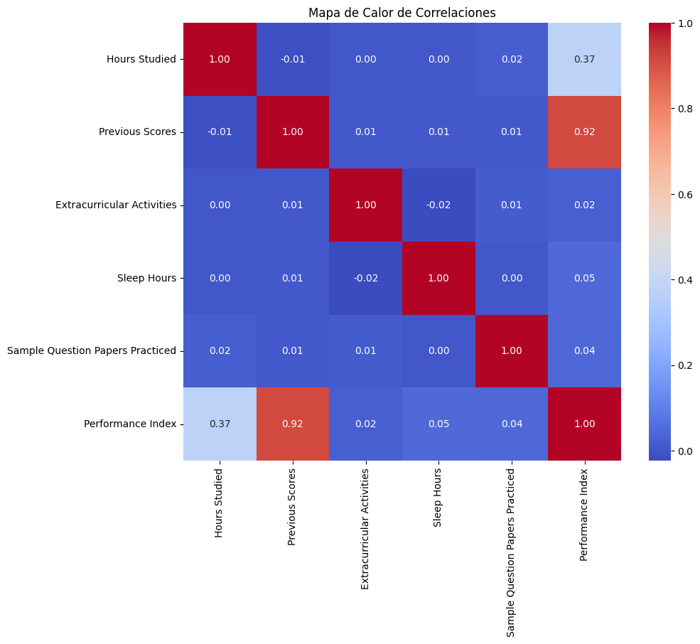
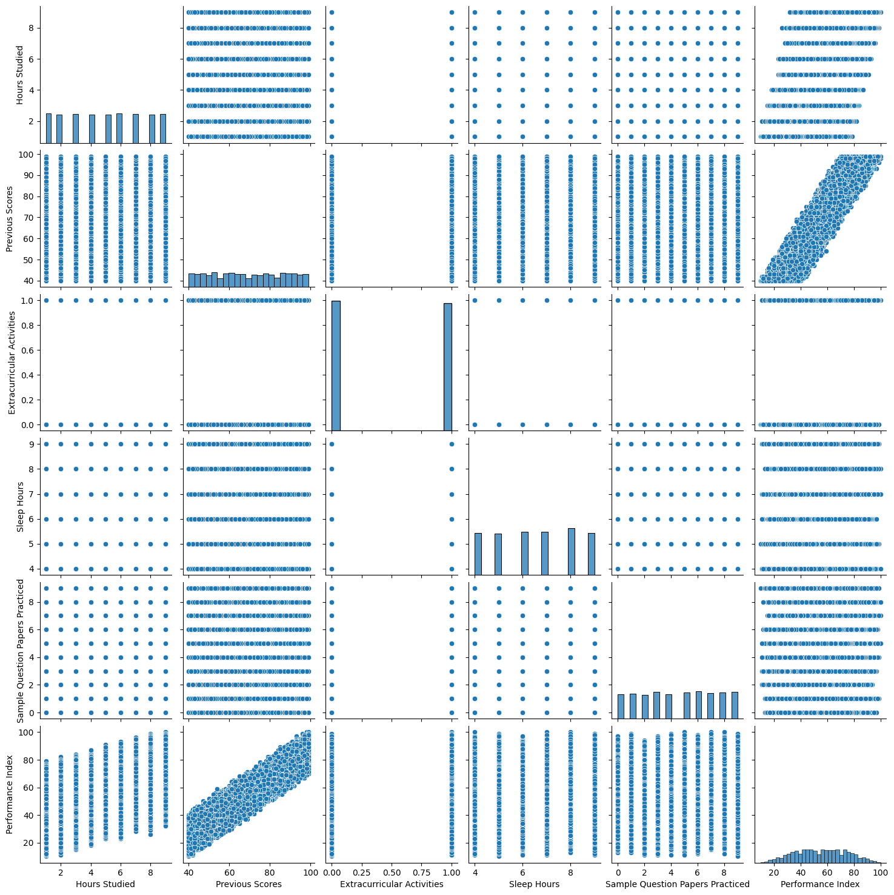
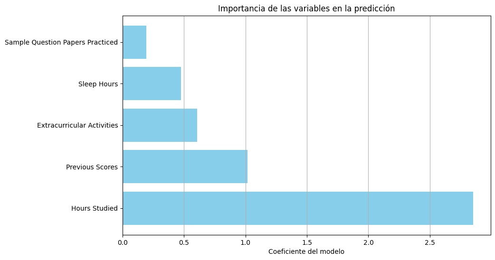

# student-performance-prediction-linear-regression
Predicting student academic performance using Multiple Linear Regression and exploratory data analysis.

Machine Learning project focused on predicting student performance using Multiple Linear Regression.

## Project Overview

This project includes:

- Data loading from Kaggle
- Data cleaning and preprocessing
- Exploratory Data Analysis (EDA)
- Correlation analysis
- Linear Regression model training
- Model evaluation using MSE and R²
- Feature importance visualization
- Example prediction

## Technologies Used

- Python
- Pandas
- NumPy
- Matplotlib
- Seaborn
- Scikit-learn

## Dataset

Student Performance Multiple Linear Regression Dataset from Kaggle.

## Machine Learning Workflow

1. Data loading
2. Data cleaning
3. Feature selection
4. Train-test split
5. Model training
6. Evaluation
7. Prediction

## Key Learnings

- Regression modeling
- Data preprocessing
- Correlation analysis
- Model evaluation
- Feature interpretation

## Data Correlation Heatmap

## Data Correlation Pairplot

## Data Correlation Feature Importance

## Key Findings

- Previous Scores showed the strongest correlation with student performance.
- Study hours positively influenced the predicted performance index.
- Extracurricular activities had a smaller impact than expected.
- Linear Regression performed well for this dataset based on the R² score.

## Limitations

- The dataset is relatively simple and structured.
- Linear Regression assumes linear relationships between variables.
- More advanced models could improve prediction performance.
